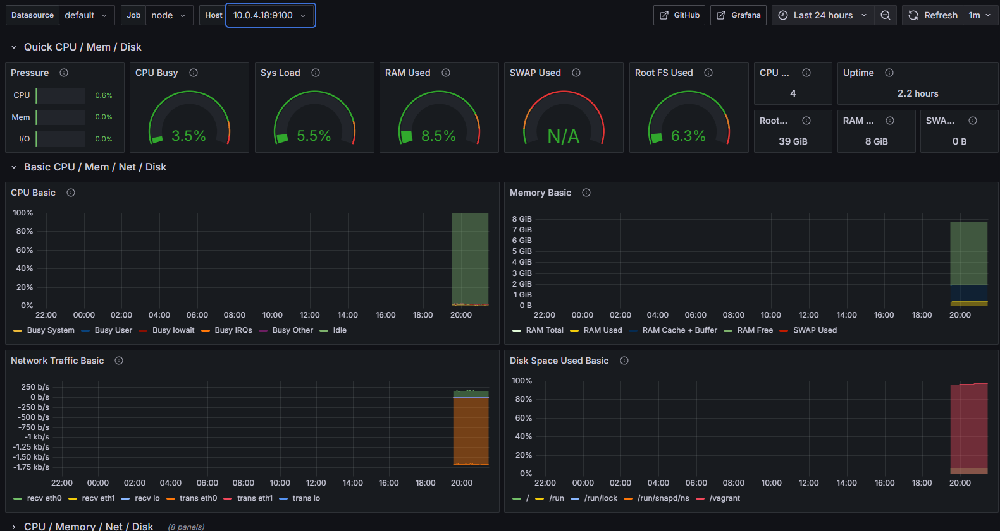

# Задание

Необходимо развернуть приложение, построенное на микросервисной архитектуре. Приложение состоит из 10 сервисов(postgresql, rabbitmq и 8 сервисов, написанных на Java). Схема разворачиваемого приложения и дополнительнпя информация содержится в директории materials. Требуется: 

1. Cоздать docker compose файл, который позволит развернуть сервисы в docker контейнерах.                          
2. Cоздание кластера, в котором будем разворачиваться на прошлом этапе docker compsoe file, при помощи docker swarm. Кластер будет состоять из 3 нод(2 worker и manager). В кластер будут объединены виртуальные машины, созданные при помощи Vagrant.
3. Собрать метрики с сервисов с помощью Prometheus.
4. Отобразить логи и метрики в Grafana.
5. Запустить AlertManager и настроить на получение уведомлений, если остается слишком мало ресурсов у ноды. 

# Архитектура приложения


# Запуск приложение в кластере с помощью Docker Swarm

## Part 1. Запуск нескольких docker-контейнеров с использованием docker compose

**1. Создал для каждого сервиса универсальный Dockerfile:**  
- Здесь я использовал принцип multi-stage, сначала происходит сборка, а потом я использую артифакты для запуска приложения. Это помогает уменьшит емкость контейнера, и защищает от потенциальных атак из-за того, что нет компиляторов и тп.  

  


**2. Создал docker-compose.yml:**  
- В нем происходит запуск всех сервисов, а также бд на базе postgres и RabbitMQ.(Можно ознакомится в файле docker-compose.yml)  
- В нем я учел зависимость от бд и RabbitMQ, поэтому сначала запустятся они, потом сервисы.  
 
- Также все переменные окружения находятся в файлах env(с ними можно ознакомится в папке src).  
  


**3. Запуск docker-compose.yml:**  
- С помощью команды ```docker-compose up``` происходит сборка, если до этого не было, и запуск всех сервисов(контейнеров)  
  


**4. Проверка сервисов с помощью Postman:**  
- Импортируем файл ```application_tests.postman_collection.json``` в приложение Postman и запускаем тесты  
  

## Part 2. Создание простейшего docker swarm

**1. Модифицируем Vagrantfile для создания manager01, worker01, worker02:**  
  
- Для загрузки необходимых утилит и запуска сервисов для manager и workers созданы bash-скрипты. С ними можно ознакомится в соответсвующих файлах **setup_manager.sh** и **setup_worker.sh**  

**2. Соберем в образы Dockerfile и запушим на Dockerhub**  
  

- также в docker-compose используются образы из dockerhub, а не Dockerfile  

**3. Поднимем виртуальные машины**  

- ```vagrant up```  

- В bash-скрипте для менеджера(setup_manager.sh) прописан запуск docker-compose.yml и запуска стека сервисов  

**4. Настроим proxy на базе nginx**   

- Конфигурационный файл  
  

- Реализуем proxy сервер как отдельный сервис в docker-compose.yml  
  

**5. Проверим работу proxy сервера с помощью Postman**  
  

**6. Используя команды docker, отобразим распределение контейнеров по узлам**  

- Проверим работу узлов  
  

- Отобразим работу стэка  
  

**7. Вирутализация кластера с помощью Portainer**  
- Общая информация о кластере  
  

- Информация о узлах  
  

- Информация о стеке  
  


# Monitoring system

## Part 3. Получение метрик и логов

**1. Создал кластер с помощью docker swarm**  

**2. Написал сборщики метрик с помощью Micrometer:**   

- Мне надо получить следующие метрики:  
    - количество отправленных сообщений в rabbitmq;  
    - количество обработанных сообщений в rabbitmq;  
    - количество бронирований;  
    - количество полученных запросов на gateway;  
    - количество полученных запросов на авторизацию пользователей.  

- Для этого получаем метрики у следующих сервисов:  
    - session  
    - gatawey  
    - report  
    - booking  

- Добавил в pom.xml каждого нам нужного сервиса зависимость micrometer:  
    ```
    <dependency>
        <groupId>org.springframework.boot</groupId>
        <artifactId>spring-boot-starter-actuator</artifactId>
    </dependency>
    <dependency>
        <groupId>io.micrometer</groupId>
        <artifactId>micrometer-core</artifactId>
    </dependency>
    <dependency>
        <groupId>io.micrometer</groupId>
        <artifactId>micrometer-registry-prometheus</artifactId>
    </dependency>
    ```  

- Добавил в application.properties в те же сервисы:  
    ```
    management.endpoints.web.exposure.include=prometheus,health,info,metric
    management.endpoint.health.show-details=always
    management.metrics.export.prometheus.enabled=true
    management.metrics.export.prometheus.step=10s
    ```  


**3. Добавил логи проложения:**  

- С помощью promtail получаю логи контейнера([promtail.yml](monitoring/promtail.yml))  

- Loki получает эти логи и агрегирует их  

**4. Добавил новый стек monitoring**  

- Написал docker compose для monitoring [docker-monitoring](monitoring/docker-monitoring.yml)  

- Проверил работоспособность сервиса Prometheus:  
  
  

## Part 4. Визуализация  

- Отобразил данные по кластеру(Docker Swarm):  
   - количество нод  
   - количество контейнеров  
   - количество стеков  
   - использование CPU по сервисам  

      

- Отобразил использование ресурсов каждой ноды:   
    - использование CPU по ядрам и узлам  
    - затраченная RAM  
    - доступная и занятая память  
    - количество CPU  


    

    

    

- Отобразил сетевые метрики  
    - доступность google.com  

      

- Отобразил метрики приложения  
    - количество отправленных сообщений в rabbitmq  
    - количество обработанных сообщений в rabbitmq  
    - количество бронирований  
    - количество полученных запросов на gateway  
    - количество полученных запросов на авторизацию пользователей  

      


- Отобразил логи приложения  
 
      


## Part 5. Отслеживание критических событий  

- Развернул alert manager как новый сервис в стеке монтиторинга  
      

- Добавил критические события  
    - доступная память меньше 100 мб  
    - затраченная RAM больше 1гб  
    - использование CPU по сервису превышает 10%  

    C ними можно ознакомится в [alerts.yml](monitoring/alerts.yml)  

- Настроить получение оповещений через личные email и телеграм  
    
    - С конфигурационным файлом AlertManager можно ознакомится в [alertmanager.yml](monitoring/alertmanager.yml)  

- Результат оповещений

      

      

