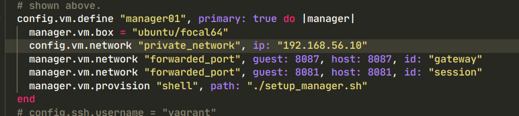
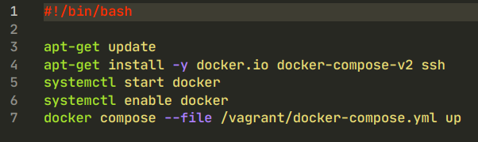
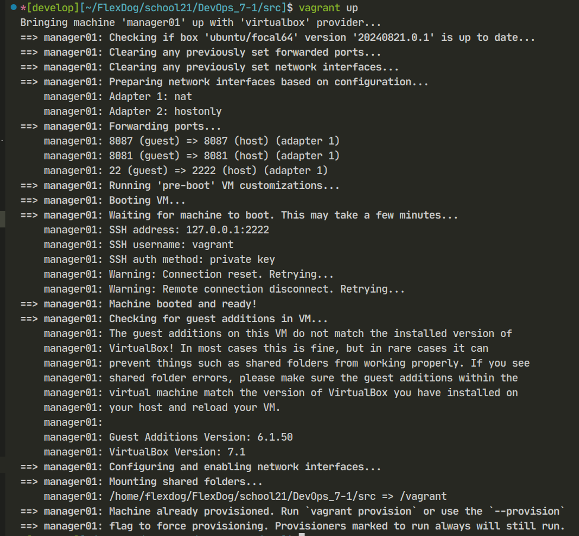
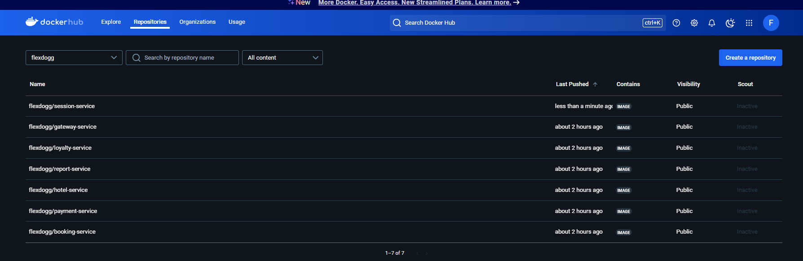
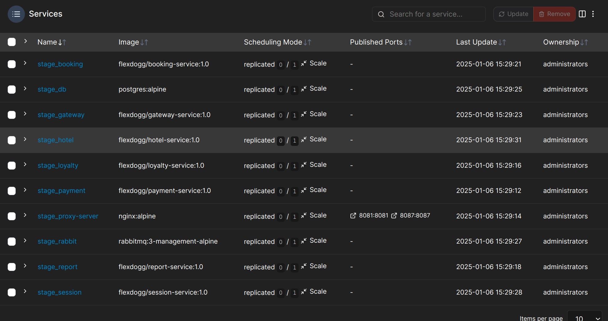

## Задание

Необходимо развернуть приложение, построенное на микросервисной архитектуре. Приложение состоит из 10 сервисов(postgresql, rabbitmq и 8 сервисов, написанных на Java). Схема разворачиваемого приложения и дополнительнпя информация содержится в директории materials. Требуется: 

1. Cоздать docker compose файл, который позволит развернуть сервисы в docker контейнерах.                          
2. Cоздание кластера, в котором будем разворачиваться на прошлом этапе docker compsoe file, при помощи docker swarm. Кластер будет состоять из 3 нод(2 worker и manager). В кластер будут объединены виртуальные машины, созданные при помощи Vagrant.


# Отчет о проделанной работе

## Part 1. Запуск нескольких docker-контейнеров с использованием docker compose

**1. Создал для каждого сервиса универсальный Dockerfile:**  
- Здесь я использовал принцип multi-stage, сначала происходит сборка, а потом я использую артифакты для запуска приложения. Это помогает уменьшит емкость контейнера, и защищает от потенциальных атак из-за того, что нет компиляторов и тп.  

  


**2. Создал docker-compose.yml:**  
- В нем происходит запуск всех сервисов, а также бд на базе postgres и RabbitMQ.(Можно ознакомится в файле docker-compose.yml)  
- В нем я учел зависимость от бд и RabbitMQ, поэтому сначала запустятся они, потом сервисы.  
 
- Также все переменные окружения находятся в файлах env(с ними можно ознакомится в папке src).  
  


**3. Запуск docker-compose.yml:**  
- С помощью команды ```docker-compose up``` происходит сборка, если до этого не было, и запуск всех сервисов(контейнеров)  
  


**4. Проверка сервисов с помощью Postman:**  
- Импортируем файл ```application_tests.postman_collection.json``` в приложение Postman и запускаем тесты  
  

## Part 2. Создание виртуальных машин

**1. Иницилизируем Vagrant в корне проекта:**  
```vagrant init```  

**2. Напишем Vagrantfile для одной виртуальной машины:**  
  

**3. Напишем скрипт для загрузки необходимых утилит в виртуальную машину(setip_manager.sh):**  
  

**4. Запустим vagrant:**  
```vagrant up```  
    

**5. Убедимся, что исходный код встал, подключившись по ssh:**
```vagrant ssh```


## Part 3. Создание простейшего docker swarm

**1. Модифицируем Vagrantfile для создания manager01, worker01, worker02:**  
  
- Для загрузки необходимых утилит и запуска сервисов для manager и workers созданы bash-скрипты. С ними можно ознакомится в соответсвующих файлах **setup_manager.sh** и **setup_worker.sh**  

**2. Соберем в образы Dockerfile и запушим на Dockerhub**  
  

- также в docker-compose используются образы из dockerhub, а не Dockerfile  

**3. Поднимем виртуальные машины**  

- ```vagrant up```  

- В bash-скрипте для менеджера(setup_manager.sh) прописан запуск docker-compose.yml и запуска стека сервисов  

**4. Настроим proxy на базе nginx**   

- Конфигурационный файл  
  

- Реализуем proxy сервер как отдельный сервис в docker-compose.yml  
  

**5. Проверим работу proxy сервера с помощью Postman**  
  

**6. Используя команды docker, отобразим распределение контейнеров по узлам**  

- Проверим работу узлов  
  

- Отобразим работу стэка  
  

**7. Вирутализация кластера с помощью Portainer**  
- Общая информация о кластере  
  

- Информация о узлах  
  

- Информация о стеке  
  